<p align="center">


<h3 align="center">ClefinCode Chat</h3>
  <p align="center">Enhance business communication with multimedia messaging and ERPNext integration.
    <br />
    <br />
    <a href="https://clefincode.com/pages/clefincode_chat_docs"><strong>Learn More »</strong></a>
     <br />   
    <br />
    <a href="https://github.com/clefincode/clefincode_chat/issues">Issues</a>
    ·
    <a href="https://github.com/clefincode/clefincode_chat/discussions">Discussions</a>
  </p>
</p>
<br>
Welcome to ClefinCode, where innovation meets digital transformation. We’re proud to introduce ClefinCode Chat, a groundbreaking solution designed to revolutionize the way businesses communicate. Our expertise in web and mobile application development has led us to create a platform that enhances, secures, and streamlines communication across your organization, ensuring that your business stays ahead in today’s digital world.

Comprehensive Communication Solution: ClefinCode Chat offers a full suite of multimedia messaging capabilities, allowing your team to share pictures, videos, files, and voice clips effortlessly. With an intuitive interface, our chat application facilitates easy adoption, enabling direct messaging or group conversations without the complexity.

Advanced Features for Business Efficiency: Our application supports dynamic participation in conversations, topic-integrated discussions, and guest messaging via a website support portal, ensuring that your communication is both efficient and comprehensive. Manage privacy and collaboration within your organization with ease, fostering a secure and productive environment.

Access Anywhere, Anytime: ClefinCode Chat is a free mobile app available for download from Google Play. This ensures that you and your team can stay connected, whether on the go or at the office.

Open Source and Customizable: Behind ClefinCode Chat is the powerful [ERPNext system](https://erpnext.com), supported by the open-source [Frappe application](https://frappeframework.com). You can download the backend code from GitHub and install it on your own server. This flexibility allows you to customize your ERPNext instance to suit your specific business needs, seamlessly integrating with both our web and mobile applications.

Dedicated Support: Our support section within the app is designed to assist you whenever you need information, help with an issue, or have questions about our ERPNext services and mobile application development. We are here to ensure that your experience with ClefinCode Chat and ERPNext is nothing short of exceptional.

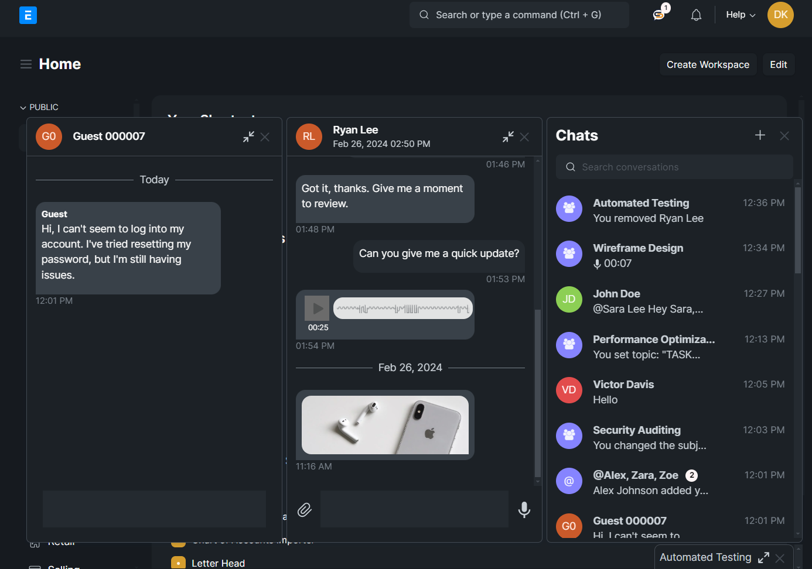

<details>
  <summary>Show more screenshots</summary>

  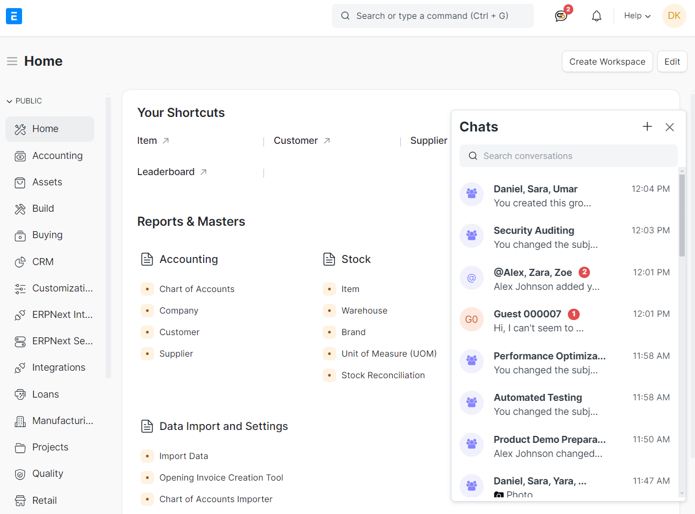
  <br>
  <br>
  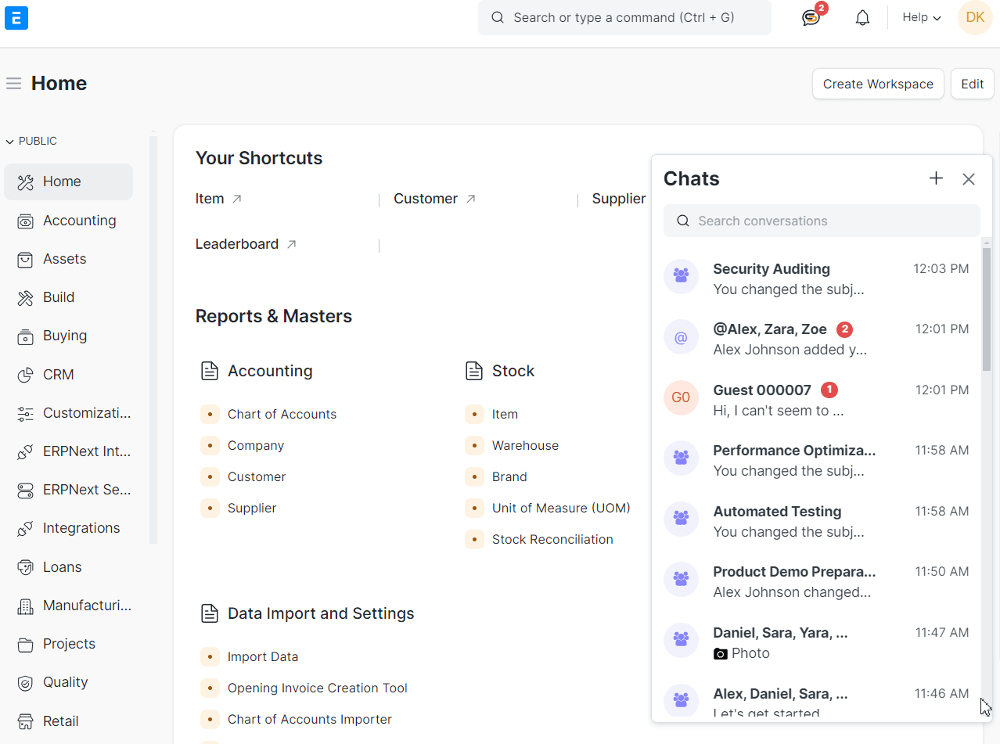
  <br>
  <br>
  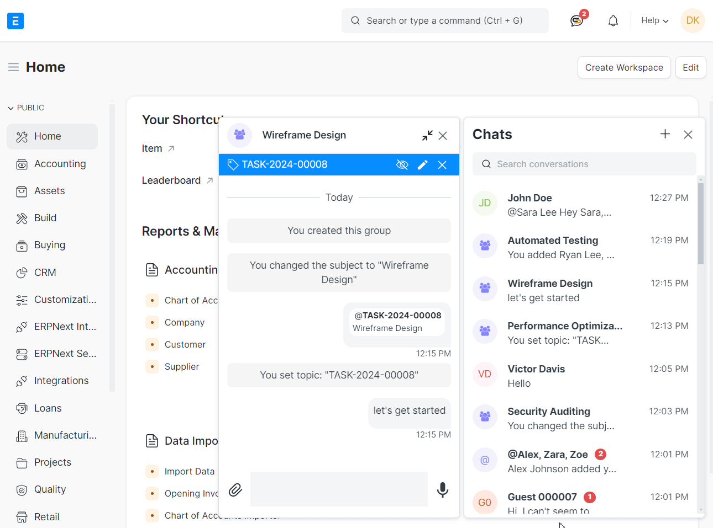
  <br>
  <br>
  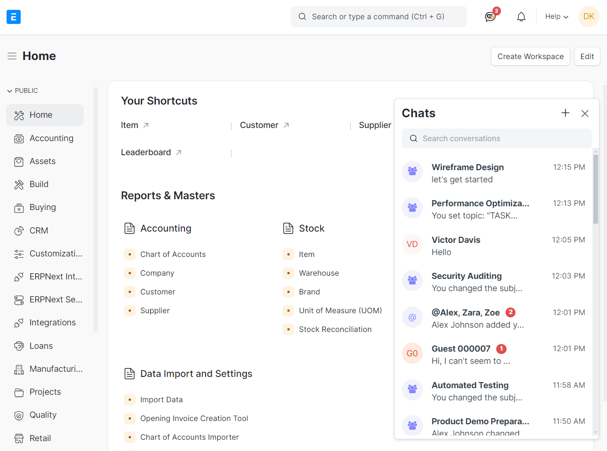
  <br>
  <br>
  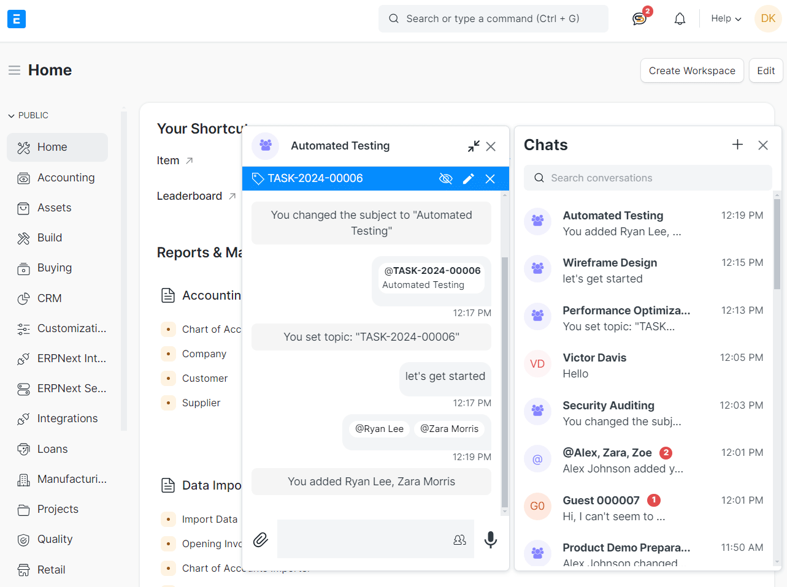
  <br>
  <br>
</details>

<hr>

## Features

## 🌐 Comprehensive Communication Solution

- 💬 **Direct & Group Messaging**: Smooth engagement in one-on-one or group chats.
- 🖼 **Multimedia Messaging**: Share pictures, videos, files, and voice clips effortlessly.
- 📱 **Intuitive Interface**: An easy-to-use application for quick adoption.

## 🚀 Advanced Features for Business Efficiency

- 🔄 **User / Doctype Mentions**: Flexibly join and contribute to conversations and topic-integrated discussions.
- 🌟 **Guest Messaging**: Enhance customer service with a website support portal.

## 🌍 Access Anywhere, Anytime

- 📲 **Mobile App Availability**: Free to download from [Google Play](https://play.google.com/store/apps/details?id=com.clefincode.chat&hl=en&gl=US) and [App Store](https://apps.apple.com/ae/app/clefincode-chat/id6478499855), keeping you connected whether on the go or at the office.
    <details>
    
    <summary>Show mobile screenshots</summary>
    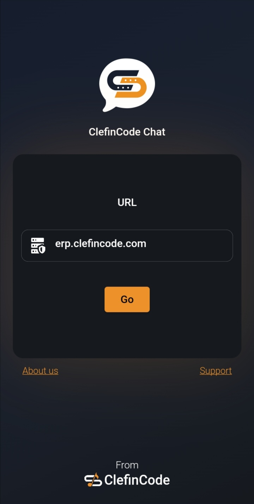
    <br>
    <br>
    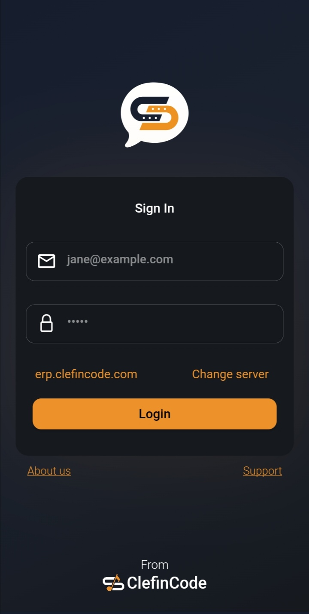
    <br>
    <br>
    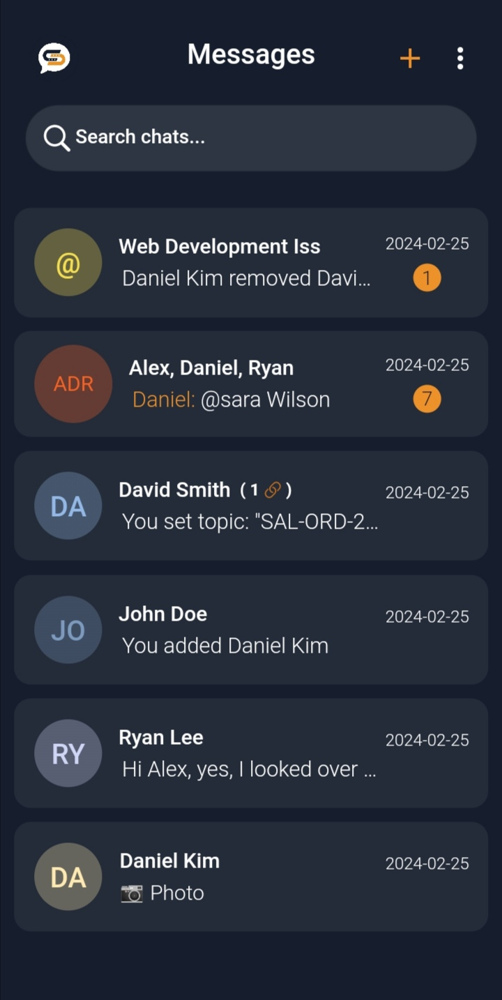
    <br>
    <br>
    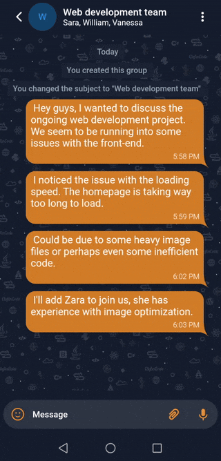
    <br>
    <br>
    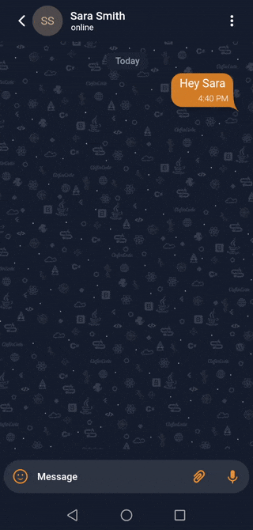
    <br>
    <br>
    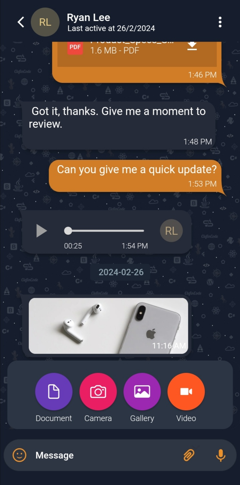
    <br>
    <br>
    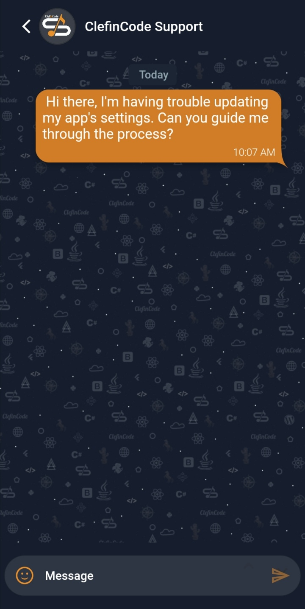
    <br>
    <br>
    </details>

## 💻 Open Source and Customizable

- 🛠 **Powered by ERPNext & Frappe**: Utilize the flexibility of open-source to customize your experience.
- 🔄 **Seamless Integration**: Seamlessly integrate with our web and mobile applications to suit specific business needs.

## 🤝 Dedicated Support

- 🆘 **In-App Support Section**: Get instant assistance, information, and answers to your ERPNext and mobile app development queries.
- 🌟 **Exceptional Experience**: We're here to ensure your experience with ClefinCode Chat is nothing short of exceptional.

## Built with

ClefinCode Chat is built using the [Frappe Framework](https://frappeframework.com) - an open-source full stack development framework.

These are some of the tools it's built on:

- [Python](https://www.python.org)
- [Redis](https://redis.io/)
- [MariaDB](https://mariadb.org/)
- [Socket.io](https://socket.io/)

The mobile app is built using [Flutter](https://flutter.dev/)
<br>

## Installation

Since ClefinCode Chat is a Frappe app, it can be installed via [frappe-bench](https://frappeframework.com/docs/v14/user/en/bench) on your local machine or on your production site.

Once you have setup your bench and your site, you can install the app via the following commands:

```bash
bench get-app https://github.com/clefincode/clefincode_chat.git
bench --site yoursite.name install-app clefincode_chat
bench --site yoursite.name migrate
bench build
```

## Reporting Bugs

If you find any bugs, feel free to report them here on [GitHub Issues](https://github.com/clefincode/clefincode_chat/issues).

## License

GNU General Public License (v3)