<p align="center">


<h3 align="center">ClefinCode Chat</h3>
  <p align="center">Enhance business communication with multimedia messaging, ERPNext integration, and multi-platform customer messaging.
    <br />
    <br />
    <a href="https://website.clefincode.com/clefincode_chat_docs"><strong>Documentation »</strong></a>
    ·
    <a href="https://github.com/clefincode/clefincode_chat/issues">Issues</a>
    ·
    <a href="https://github.com/clefincode/clefincode_chat/discussions">Discussions</a>
    <br />
    <br />
    <a href="https://play.google.com/store/apps/details?id=com.clefincode.chat&hl=en&gl=US">Google Play</a>
    ·
    <a href="https://apps.apple.com/ae/app/clefincode-chat/id6478499855">App Store</a>
  </p>
</p>

<br>

ClefinCode Chat is a business communication app built for ERPNext/Frappe. It brings internal team chat, customer support conversations, multimedia sharing, WhatsApp messaging, Telegram, Instagram, Messenger, topics, templates, notifications, and document-linked discussions into one connected workspace.

The app supports direct messages, group conversations, document-linked topics, guest/support messaging, mobile access, and web chat controls designed for productivity inside ERPNext.

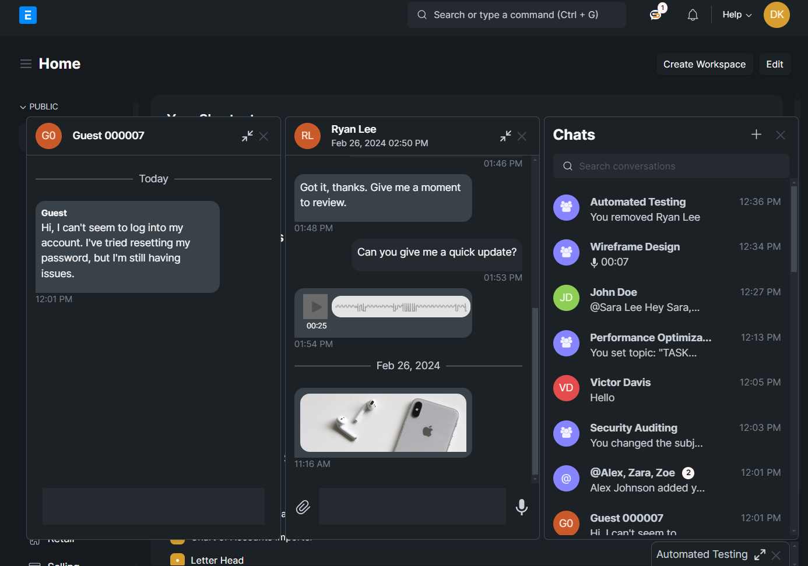

<details>
  <summary>Show more web screenshots</summary>

  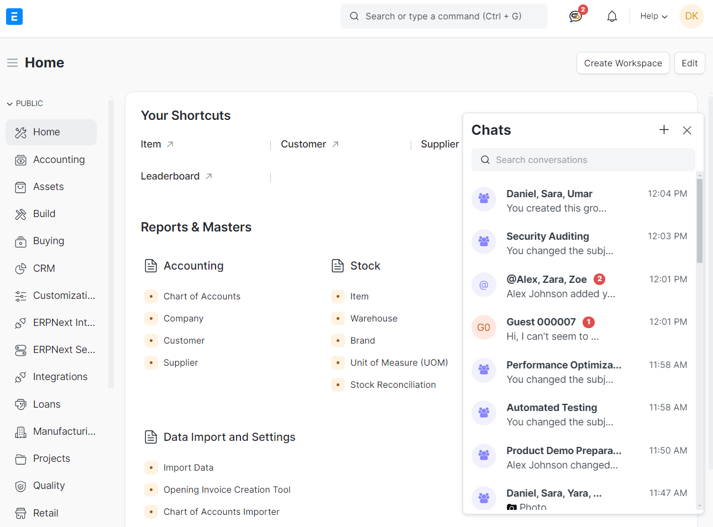
  <br><br>
  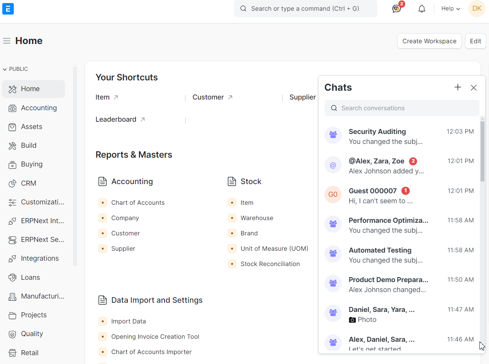
  <br><br>
  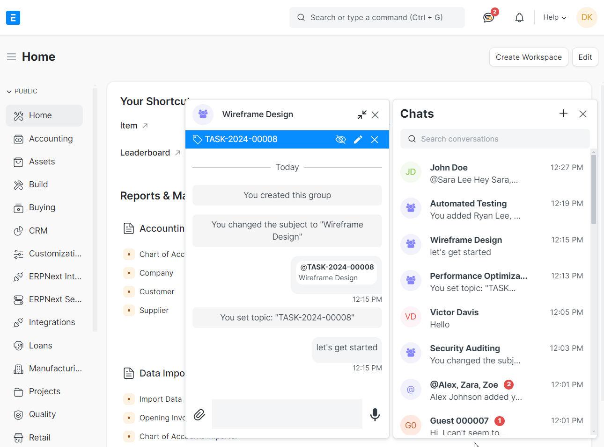
  <br><br>
  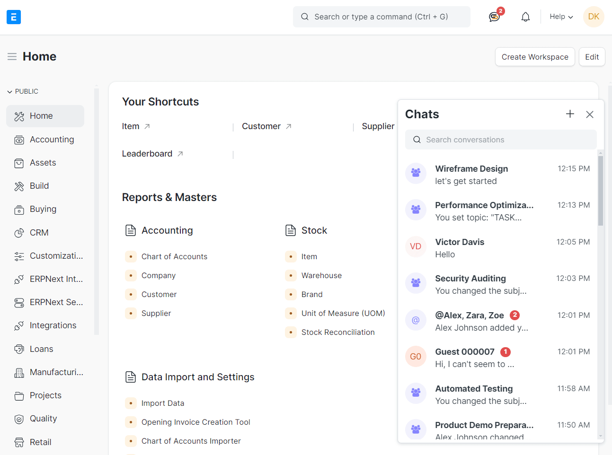
  <br><br>
  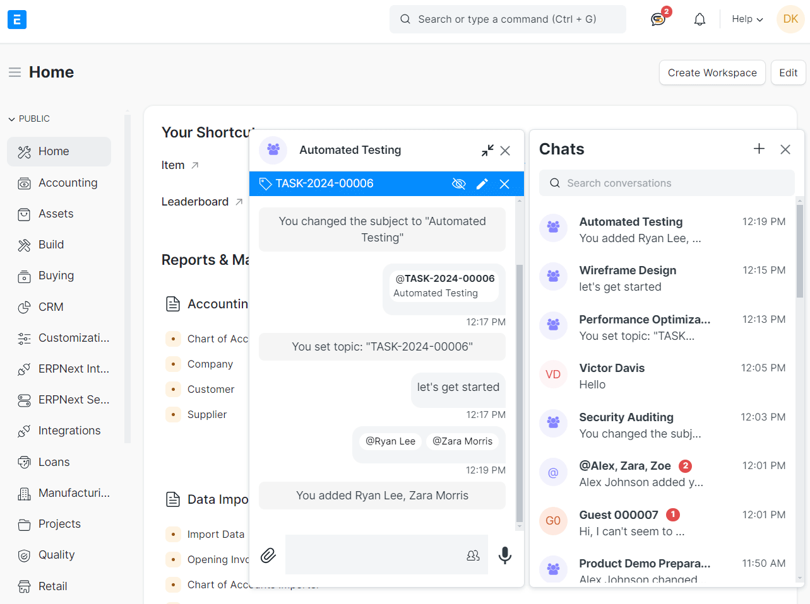
  <br><br>
</details>

<hr>

## Documentation

Full product documentation is available here:

- [ClefinCode Chat Documentation](https://website.clefincode.com/clefincode_chat_docs)
- [Web UI Features](https://website.clefincode.com/clefincode_chat_docs#web-ui-features)
- [Twilio WhatsApp Integration](https://website.clefincode.com/clefincode_chat_docs#twilio-whatsapp-integration)
- [Twilio Template](https://website.clefincode.com/clefincode_chat_docs#twilio-template)
- [Meta WhatsApp Cloud API Setup](https://website.clefincode.com/clefincode_chat_docs#meta-whatsapp-cloud-api-setup)
- [Edit and Add Contacts](https://website.clefincode.com/clefincode_chat_docs#edit-and-add-contacts)

## Features

### 🌐 Comprehensive Communication Solution

- 💬 **Direct & Group Messaging**: Start one-on-one conversations or group chats with selected contacts.
- 🖼 **Multimedia Messaging**: Share images, videos, documents, links, and files directly in chat.
- 🎙 **Voice Clips**: Record and send short voice messages from the composer.
- 🔎 **Conversation Search**: Search chats and locate important conversations quickly.
- 🧵 **Multiple Web Conversations**: Keep multiple chat windows open in ERPNext web.
- 🌙 **Dark Theme**: Use a comfortable dark interface for extended work sessions.

### 🚀 Business Collaboration Inside ERPNext

- 🔗 **DocType / Topic Linking**: Link conversations to ERPNext records such as Task, Issue, Project, Invoice, Item, or other business documents.
- 👥 **Contributors**: Add or remove contributors from group conversations.
- @️⃣ **Mentions**: Mention users to direct attention in team conversations.
- 🧩 **Topic Conversations**: Organize related messages under topics and open dedicated topic conversations.
- 🔁 **ReLink Messages**: Link one or more existing messages to an existing or new topic.
- 🧾 **Message Info**: View message metadata, sender, linked topic, sent time, message type, and message ID.

### 📲 Multi-Platform Messaging

ClefinCode Chat supports customer and business messaging across multiple channels:

- WhatsApp
- Telegram
- Instagram
- Facebook Messenger

Conversations can show platform badges so users can identify the channel directly from the chat interface.

### 🌍 Access Anywhere, Anytime

- 📲 **Mobile App Availability**: Free mobile app on [Google Play](https://play.google.com/store/apps/details?id=com.clefincode.chat&hl=en&gl=US) and [App Store](https://apps.apple.com/ae/app/clefincode-chat/id6478499855).
- 💻 **Web Access**: Runs inside your ERPNext/Frappe web environment.
- 🆘 **Support Conversation**: Contact ClefinCode Support from inside the app when enabled.

<details>
  <summary>Show mobile screenshots</summary>

  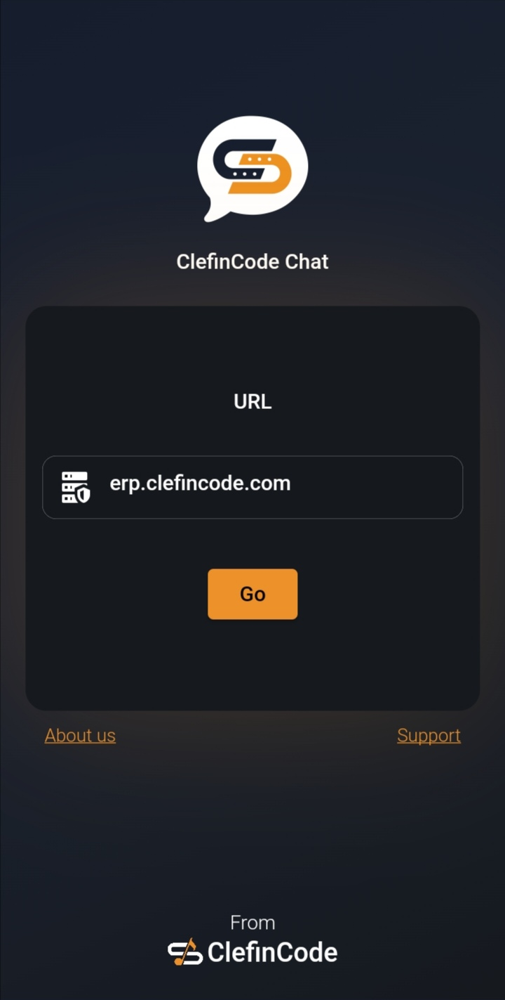
  <br><br>
  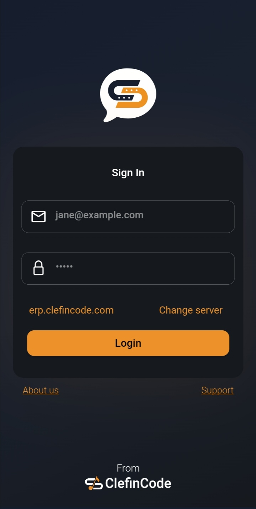
  <br><br>
  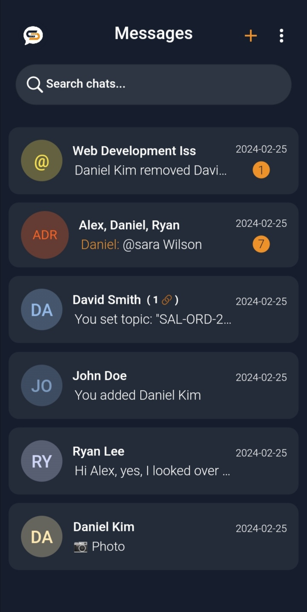
  <br><br>
  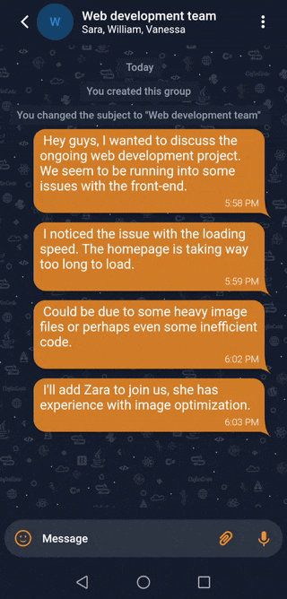
  <br><br>
  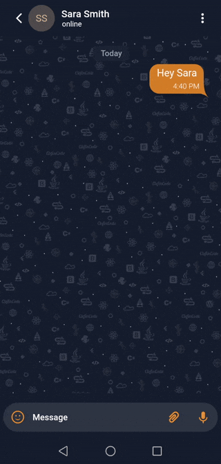
  <br><br>
  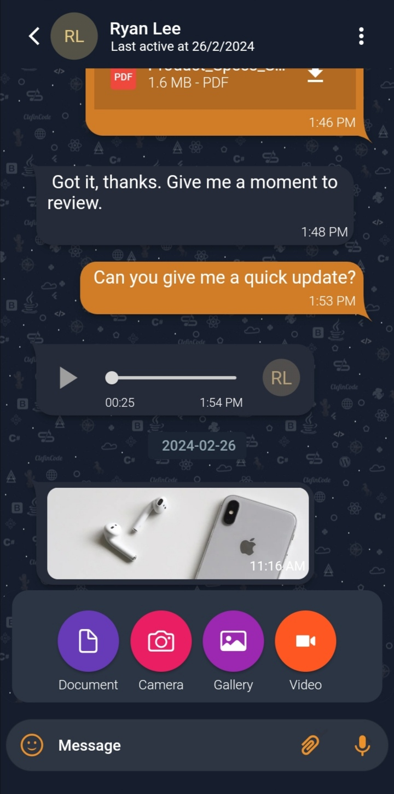
  <br><br>
  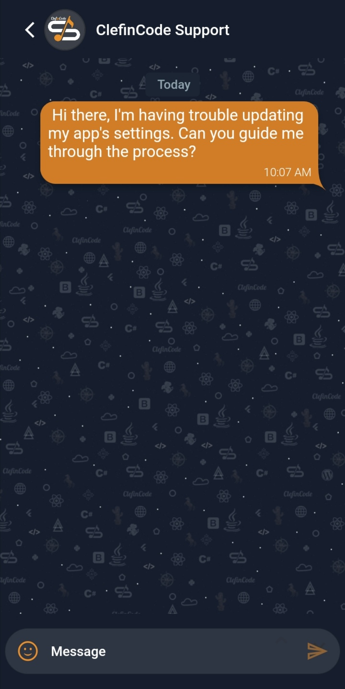
  <br><br>
</details>

### 💻 Open Source and Customizable

ClefinCode Chat is powered by [ERPNext](https://erpnext.com) and the [Frappe Framework](https://frappeframework.com). You can install the backend app on your own server and customize it to match your organization’s workflow.

### 🤝 Dedicated Support

Use the in-app support section to request help, ask questions, or discuss ERPNext and mobile app development support with the ClefinCode team.

## Built With

ClefinCode Chat is built using the [Frappe Framework](https://frappeframework.com), an open-source full-stack development framework.

Core technologies include:

- [Python](https://www.python.org)
- [Redis](https://redis.io/)
- [MariaDB](https://mariadb.org/)
- [Socket.io](https://socket.io/)
- [Flutter](https://flutter.dev/) for the mobile app

## Installation

Since ClefinCode Chat is a Frappe app, it can be installed via [frappe-bench](https://frappeframework.com/docs/v14/user/en/bench) on a local machine or production site.

```bash
bench get-app https://github.com/clefincode/clefincode_chat.git
bench --site yoursite.name install-app clefincode_chat
bench --site yoursite.name migrate
bench build
```

**Note:** If migrating from version `< 1.3.0` to `> 1.3.0`, run the following command before migrate:

```bash
bench setup requirements
```

## Quickstart

### Log in with your Frappe account

Use your email and password, then confirm the correct server URL. You can switch servers when needed.

- Enter your email and password.
- Confirm the server domain, for example `erp.clefincode.com`.
- Use **Change server** when you need to switch environments.

Web access depends on your ERPNext permissions and enabled chat configuration.

### Start a direct chat

- Open the chat panel.
- Click the `+` button or new chat action.
- Search and select a contact.
- Send your first message to start the conversation.


### Start a group chat

- Open the chat panel.
- Start a new conversation.
- Select multiple contacts.
- Confirm to create the group.
- Use group tools to manage the subject, topic, and contributors.


### Manage contributors

- Open group details.
- Add contributors as needed.
- Remove contributors when the scope changes.
- Use **Exit group** when you no longer need access.


### Link chats to DocTypes and topics

Attach a chat topic to a document so the conversation stays aligned with a specific ERPNext record.

- Open the chat and access topic controls.
- Select the related DocType, such as Task, Issue, Project, Sales Invoice, or Item.
- Save the topic so linked messages remain organized.


## Messaging & Sharing

### Share media and documents

Users can share PDFs, images, camera captures, videos, links, and other files directly in the chat thread.

On web, users can upload files or drag and drop them into the chat window.

### Voice clips

Voice messages are supported from the chat composer alongside other sharing options.

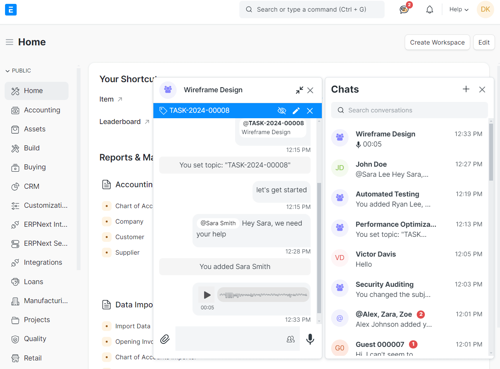

## Multi-Platform Messaging Setup

### WhatsApp setup through Meta Cloud API

Use this option to connect WhatsApp Business Platform / Cloud API directly without Twilio.

#### Requirements

- Personal Facebook account to manage Meta Business.
- Meta Business Portfolio for the company.
- Work email, preferably on the company domain.
- Official company documents for Business Verification.
- Phone number not currently registered on WhatsApp and able to receive SMS or voice OTP.
- Public HTTPS webhook endpoint for incoming messages and delivery statuses.

#### Setup steps

1. Create a Meta Business Portfolio.
2. Complete Business Verification and enable security requirements.
3. Create a Meta Developer App and add WhatsApp.
4. Add and verify the WhatsApp phone number.
5. Save the Phone Number ID and WhatsApp Business Account ID.
6. Create a System User token with these permissions:
   - `whatsapp_business_messaging`
   - `whatsapp_business_management`
7. Configure the webhook callback URL and subscribe to `messages`.

Webhook endpoint example:

```text
https://YOUR_DOMAIN.com/api/method/clefincode_chat.webhook.handle
```

**Security:** Never expose Access Tokens in frontend code, screenshots, or GitHub. Store them in secure settings or environment variables.

### WhatsApp setup inside ClefinCode Chat

#### 1. Enter WhatsApp credentials

- Access Token
- Webhook Verify Token


#### 2. Create a WhatsApp profile

- Enter WhatsApp Number.
- Enter Phone Number ID.
- Enter WhatsApp Business Account ID.
- Select Type: **Personal** or **Support**.

Important tip: When entering the WhatsApp number, do not include `00` or `+`. Start directly with the country code, for example `971xxxxxxxxx`.


### Instagram setup

Configure Instagram credentials and create a profile to route messages to the correct system user.

- Enter Instagram credentials.
- Create an Instagram profile.
- Enter Instagram Profile ID and Instagram App ID.
- Select Type: Personal or Business.

Important tip: Enter the username without the `@` symbol, for example `example_username`.

Documentation: [Instagram setup](https://website.clefincode.com/clefincode_chat_docs#instagram-setup-web)

### Telegram setup

Configure the Telegram bot token, confirm that the site webhook is set successfully, then create a Telegram profile and assign it to the correct system user.

- Open BotFather in Telegram.
- Create a new bot or select an existing one.
- Copy the Bot Token.
- Open the Telegram integration Bot DocType.
- Enter a clear name.
- Paste the Bot Token and save.
- Make sure **Site Webhook Successfully Set** appears.
- Create a ClefinCode Telegram Profile and assign users.

Documentation: [Telegram setup](https://website.clefincode.com/clefincode_chat_docs#telegram-setup-web)

### Facebook Messenger setup

Configure Messenger integration and profiles to enable inbound and outbound messaging through Facebook Page IDs.

Important tip: Ensure the Messenger Profile ID matches the correct Facebook Page ID and confirm required app permissions for messaging.

Documentation: [Facebook Messenger setup](https://website.clefincode.com/clefincode_chat_docs#facebook-messenger-setup-web)

## Twilio Meta Connection Guide

Use this setup when WhatsApp will be connected through Twilio instead of direct Meta Cloud API calls. Twilio acts as the provider, while Meta Business Portfolio and WABA own the WhatsApp business setup.

### Requirements before Twilio onboarding

- Upgraded Twilio account with billing enabled.
- Meta Business Portfolio owned by the company.
- Admin access to the Meta Business Portfolio.
- Twilio number or external number not already registered on WhatsApp.
- Access to receive OTP by SMS or voice call.
- Clear WhatsApp display name aligned with the business or brand.

### Twilio onboarding steps

1. Buy or select a Twilio phone number that can receive the WhatsApp verification code.
2. Go to Twilio Console → Messaging → Senders → WhatsApp Senders.
3. Start WhatsApp Sender registration.
4. Continue with Facebook.
5. Authorize Twilio and select the correct Meta Business Portfolio.
6. Create or select the WhatsApp Business Account (WABA).
7. Enter WhatsApp Business Profile details and display name.
8. Add and verify the phone number by SMS or voice OTP.
9. Refresh WhatsApp Senders in Twilio until the sender is ready.

Documentation: [Twilio Meta Connection Guide](https://website.clefincode.com/clefincode_chat_docs#twilio-meta-connection-guide)

## Twilio WhatsApp Integration

Connect WhatsApp through Twilio to manage inbound and outbound messages directly inside ERPNext.

### 1. Enter Twilio credentials

Add your Twilio credentials:

- Twilio Account SID
- Auth Token

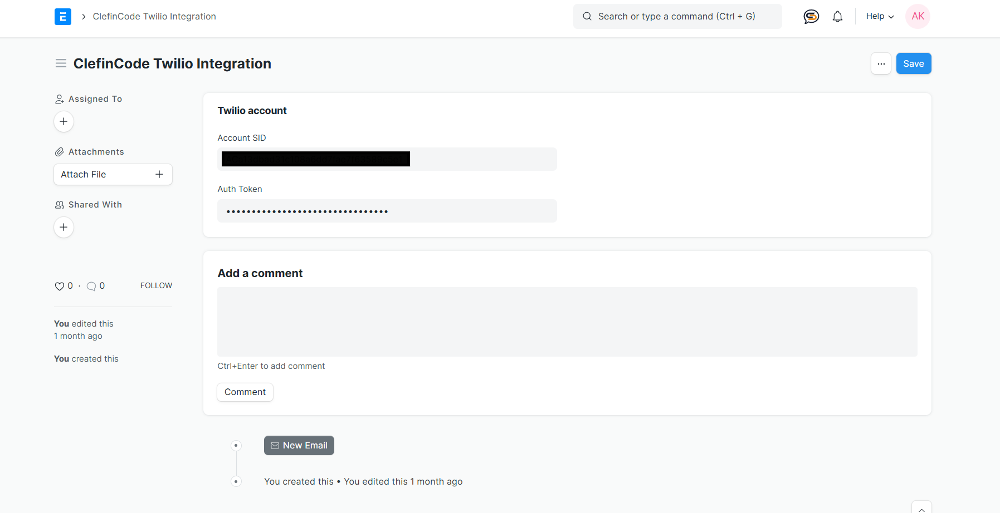

### 2. Create a Twilio WhatsApp profile

- Select the WhatsApp-enabled number from Twilio.
- Select Provider: **Twilio**.
- Choose Type: **Personal** or **Support**.
- Save the profile.

Important tip: A template will be created automatically and its preview will be visible.

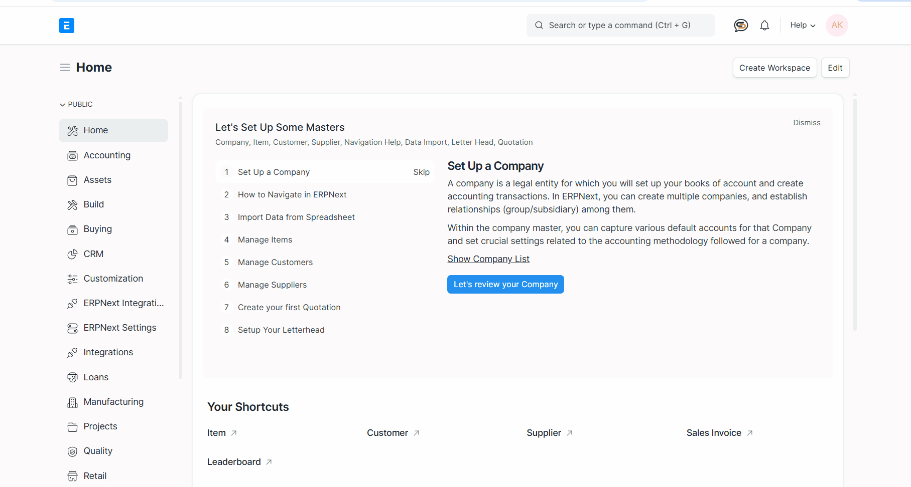

### 3. Configure Twilio webhook

Configure Twilio webhooks to receive incoming WhatsApp messages and track outbound message status updates.

Webhook URL:

```text
https://Base_URL/api/method/whatsapp_twillio
```

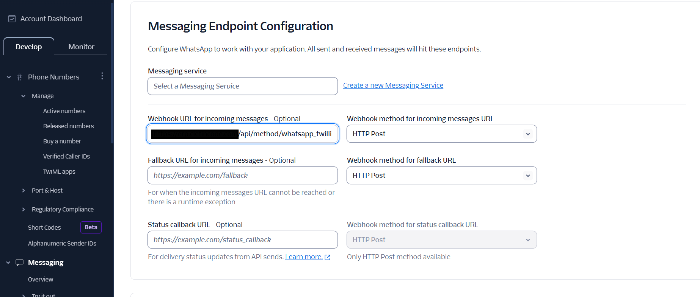

### 4. Test WhatsApp messaging

Test sent messages:

- Text
- Image
- Voice note

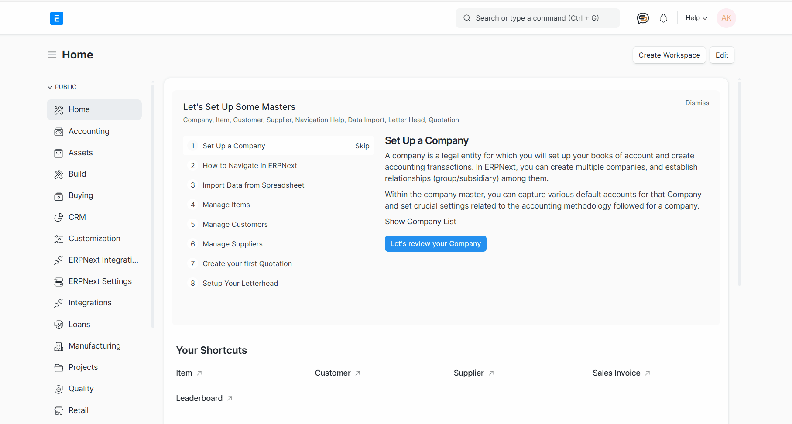

Test received messages:

- Text
- Image
- Voice note
- Location
- Contact

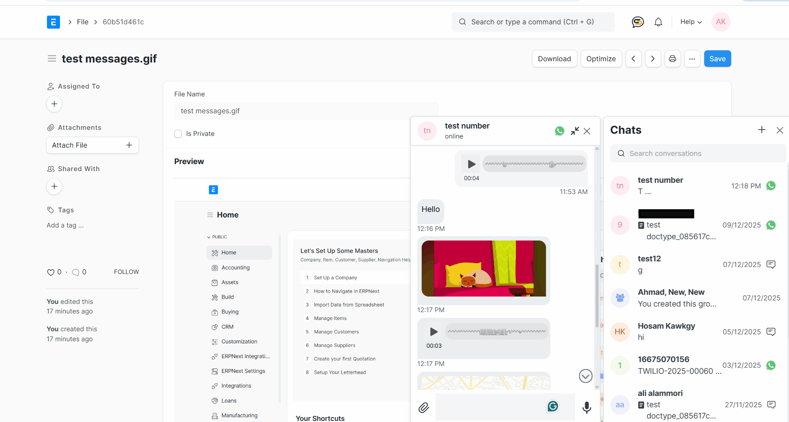

## Twilio Templates

Create message templates, submit them for approval, then send them from chat using `/`.

### Create Twilio text template

- Enter Friendly Name.
- Select Template Type: `twilio/text`.
- Select Category.
- Select Language.
- Write the message in Body.
- Save, submit, and wait for approval.

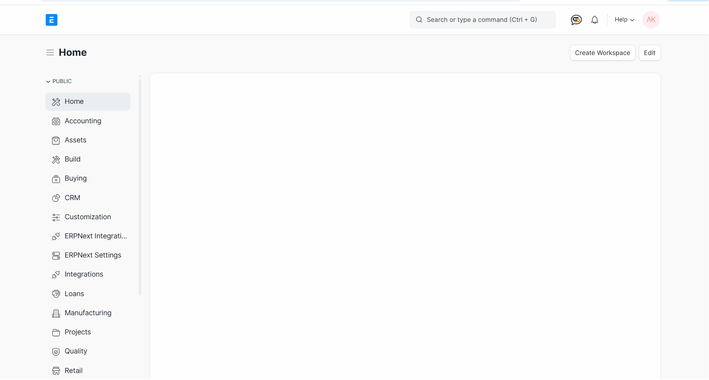

### Meta / WhatsApp template name rules

- Allowed characters: lowercase alphanumeric only (`a-z`, `0-9`).
- Allowed separator: underscore `_` only.
- No spaces.
- No special characters such as `! @ # $ % - .`.
- Use meaningful names, for example `order_delivery`.
- Keep names unique when template content is unique.

### Create Twilio media template

- Enter Friendly Name.
- Select Template Type: `twilio/media`.
- Select Category.
- Select Language.
- Write the message in Body.
- Add media link in Media URL.
- Save, submit, and wait for approval.

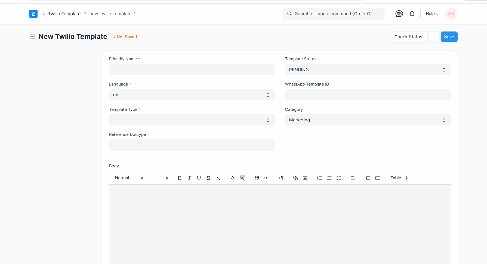

### Create quick reply template

- Enter Friendly Name.
- Select Template Type: `quick-replay`.
- Write the message in Body.
- Add button and value in the actions table.
- Save, submit, and wait for approval.

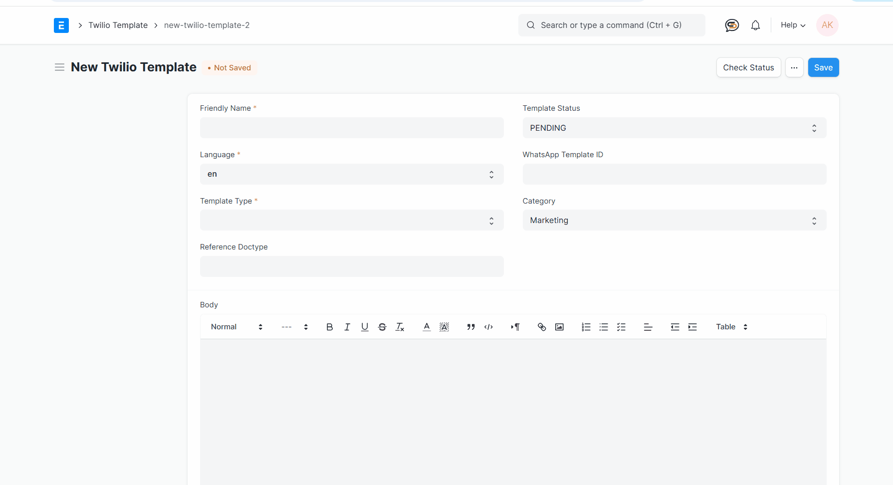

### Create list picker template

- Enter Friendly Name.
- Select Template Type: `list-picker`.
- Write the message in Body.
- Add list items in the Items table.
- Save, submit, and wait for approval.

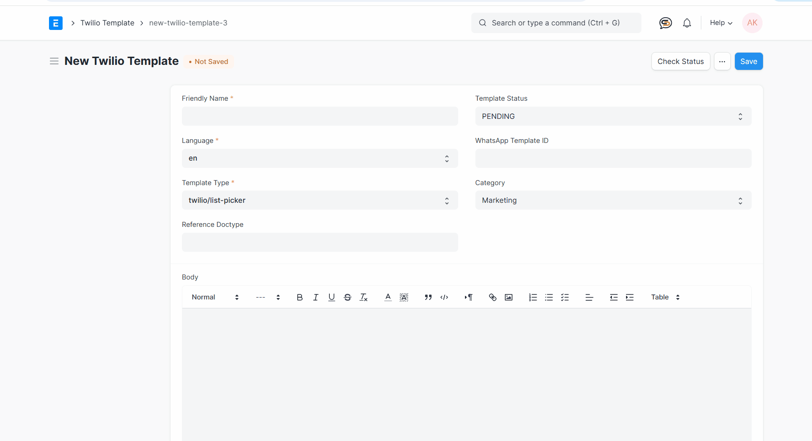

### Use variables

Twilio variables personalize content templates. Variables use `{{...}}` syntax and are populated with dynamic data when the message is sent.

Variables can be mapped to fields from the associated DocType by filling the variables table.

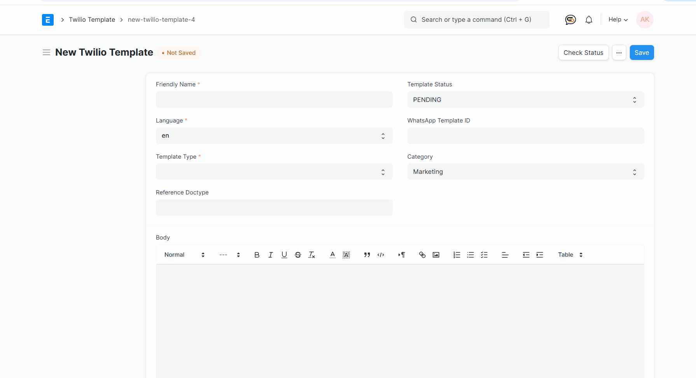

Important tips:

- Variables must be sequential: `{{1}}`, `{{2}}`, `{{3}}`.
- Variables should not be adjacent.
- Variables should not start or end the message.
- Must have enough text: `(2x + 1)` non-variable words per `x` variables.
- Avoid too many variables in short messages.

### Add variable to media template

- Set the base URL of your site.
- Select the field with the attached file.
- Add a default value.

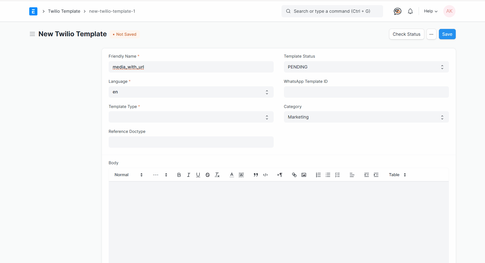

### Attach DocType print to template

To send the connected DocType print:

- Use a Media Template and add a variable.
- No need to add a DocType field, but a default value is required.
- Enable **Attach Document Print**.
- Select Print Format.
- Select Language Format: English.
- Select Letter Head.

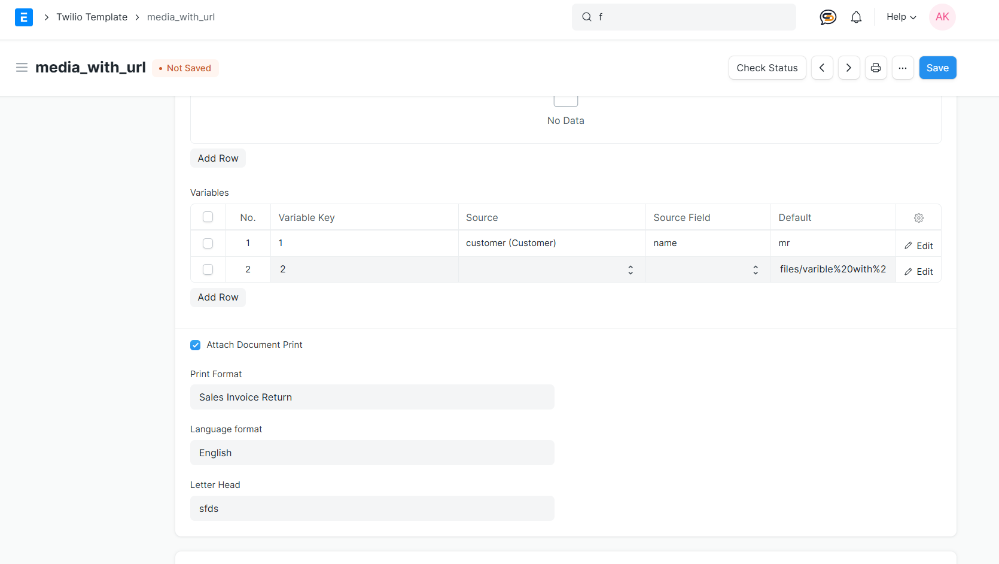

### Send template from chat

- Open Chat.
- Type `/` and wait for approved templates.
- Select a template.
- If linked to a DocType, choose the required document.

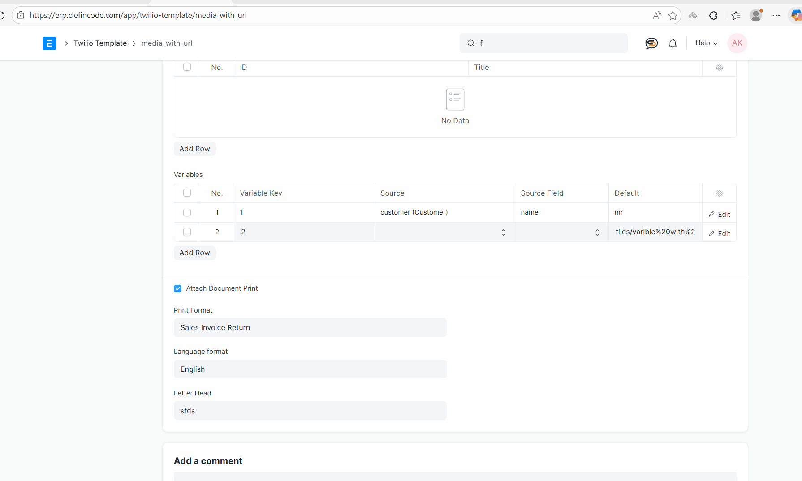

## ClefinCode Notification

ClefinCode Notification sends WhatsApp notifications automatically based on DocType events.

### Create ClefinCode Notification

- Create a WhatsApp notification and link it to the required DocType.
- Add a Custom Field to the DocType of type Link connected to Chat Profile.
- Select the trigger event, such as **On Save** or **On Submit**.
- Choose the message type: **Template** or **Normal Message**.
- If Normal Message is selected, variables can be added dynamically from DocType fields.
- If Template is selected, only templates linked to the selected DocType will appear.
- Preview displays automatically when a template is selected.
- If the selected template supports document printing, **Attach Print** is enabled automatically.
- Configure the recipient using the selected Chat Profile.
- Optionally attach the document as a PDF by selecting the required Print Format.
- Save and enable the notification to activate automatic WhatsApp sending.

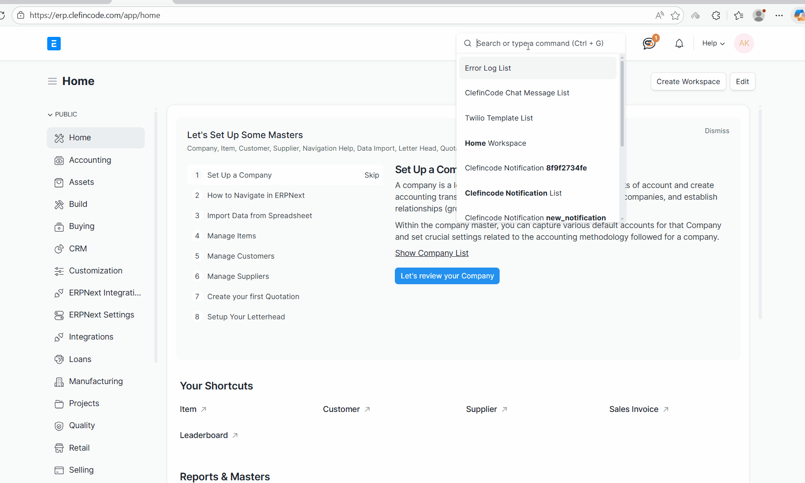

## ClefinCode Chat Template

ClefinCode Chat Template is used to create and manage reusable WhatsApp templates. Templates can include variables, optional document prints, and links to specific DocTypes.

### Create template

- Open ClefinCode Chat Template.
- Enter the Template Name.
- Select the Reference DocType, if needed.
- Write the message.
- If a DocType is selected, add variables similar to Twilio templates.
- Save the template.

### Test sending template

- Open a chat conversation.
- Type `/` in the chat input.
- Select the created template.
- If linked to a DocType, choose the required document.

Documentation: [ClefinCode Chat Template](https://website.clefincode.com/clefincode_chat_docs#clefincode-chat-template)

## Manage Contacts

Add and manage contacts directly from the chat interface, including multiple identifiers per contact.

### Manage Contacts

- Click the **Chat** icon.
- Click the **+** button.
- Select **Add Contact** to create a new contact.
- Admins can edit contacts using **Manage Contact**.
- Update contact details in the popup window.
- If an identifier already exists, the system will show an error.

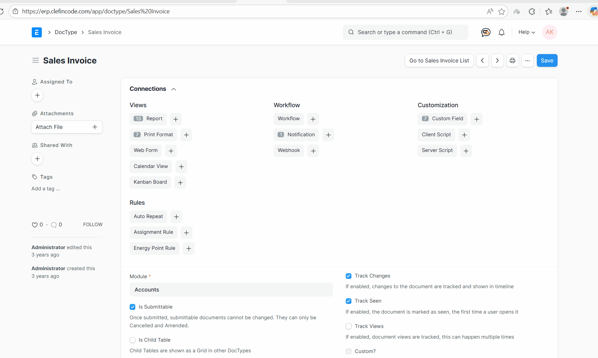

### ClefinCode Chat Profile

A Chat Profile centralizes all identifiers for a person or company and maps them to a system user.

- Create a Chat Profile and define its name.
- Assign a System User.
- Add one or more contact identifiers.
- Supported identifiers include WhatsApp, Telegram, Instagram, and Messenger.
- The profile keeps all identifiers organized in one place.

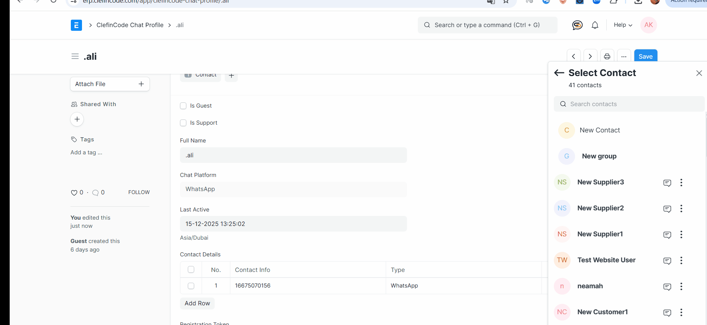

## ClefinCode WhatsApp Profile

Personal messages are delivered directly to the selected user.

For Support Profiles:

- **Receive By User** automatically adds the selected user to the conversation.
- **Receiver Role** distributes messages randomly among users with that role.
- To always include a specific user in all support chats, use **User – Receive By User**.

Documentation: [ClefinCode WhatsApp Profile](https://website.clefincode.com/clefincode_chat_docs#clefincode-whatsapp-profile)

## 🖥 Web UI Features

Powerful and intuitive message controls designed to enhance productivity, organize conversations by topics, and keep discussions structured inside ERPNext.

### ⚡ Message Actions Menu

Each message has a small arrow beside it. Click this arrow to open available message actions.

Available actions include:

- **Edit** — edit the message content.
- **Reply** — reply to a specific message.
- **Copy** — copy message text.
- **React** — add an emoji reaction.
- **Forward** — forward one or more messages.
- **ReLink** — link one or more messages to a topic.
- **Delete** — delete the message.
- **Message Info** — view message details.

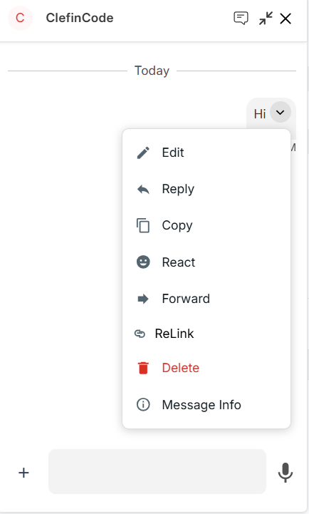

### ↩️ Reply to Messages

Reply to a specific message and keep the context linked.

1. Click the small arrow beside the message.
2. Select **Reply**.
3. Type your response and send.

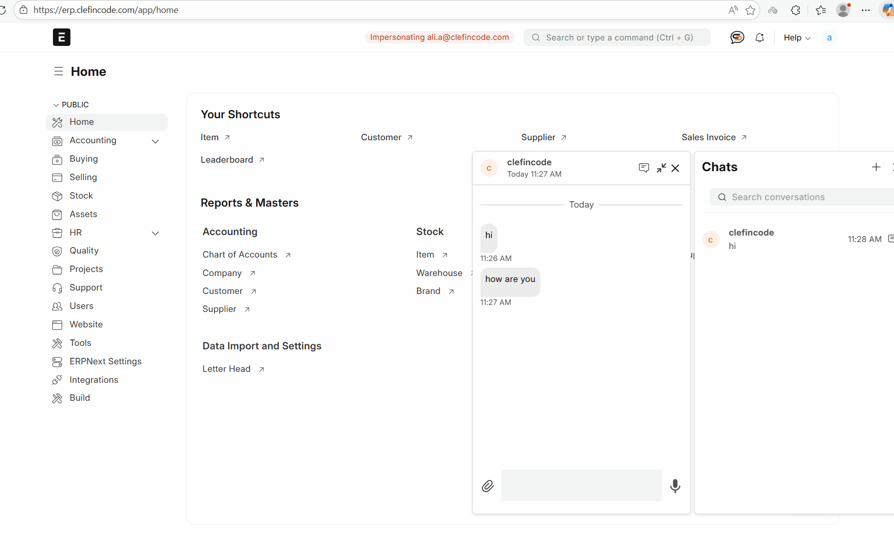

### 🔁 Forward Messages

Forward supports multi-select, allowing users to forward one or more messages at the same time.

1. Click the small arrow beside a message.
2. Select **Forward**.
3. The chat enters selection mode and checkboxes appear beside messages.
4. Select one or more messages.
5. Choose the contact, group, or channel.
6. Confirm to forward the selected messages.

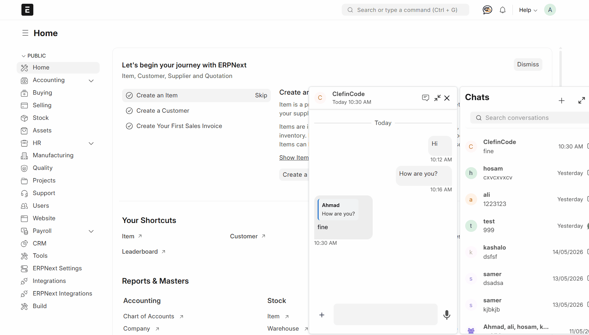

### ✏️ Edit Sent Messages

Edit a sent message using a rich text editor with formatting tools.

1. Click the small arrow beside the message.
2. Select **Edit**.
3. The edit dialog opens with a rich text editor.
4. Update the message content.
5. Click **Save** to apply changes, or **Cancel** to close without saving.

The editor supports formatting such as bold, italic, underline, lists, links, images, alignment, and tables.

**Important:** Editing is only allowed within **7 minutes** of sending the message. This can be changed from **Chat Settings**.

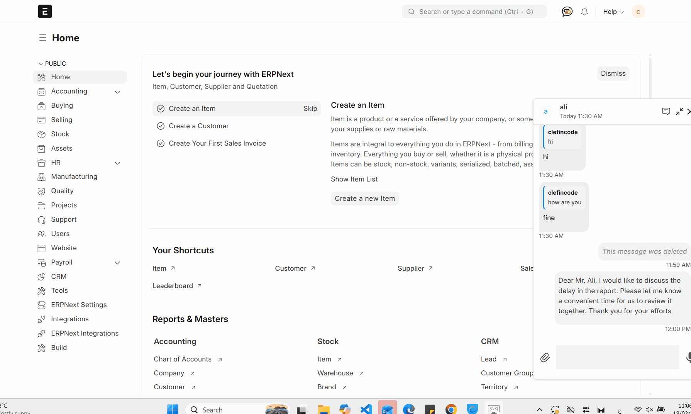

### 🗑 Delete Messages

Delete a message within the configured time limit.

1. Click the small arrow beside the message.
2. Select **Delete**.
3. Confirm the deletion.

**Important:** Messages cannot be edited or deleted after **7 minutes** from sending, unless the time limit is changed from **Chat Settings**.

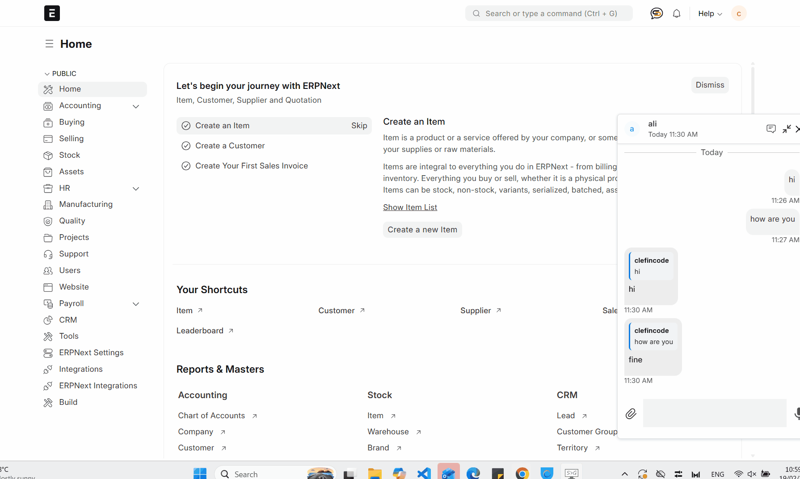

### 😀 Message Reactions

React with emojis to reduce unnecessary replies.

1. Click the small arrow beside the message.
2. Select **React**.
3. Choose the desired emoji reaction.

You can remove a reaction by clicking the same emoji again, or change your reaction by selecting a different emoji.

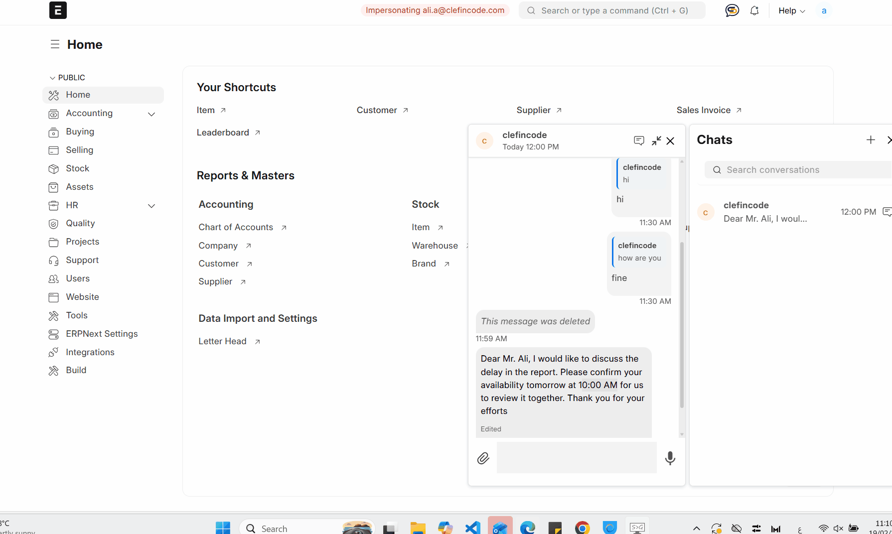

### 🔗 ReLink Messages to Topic

ReLink allows users to connect one or more messages to an existing topic or create a new topic.

1. Click the small arrow beside a message.
2. Select **ReLink**.
3. The chat enters selection mode and checkboxes appear beside messages.
4. Select one or more messages.
5. Click **ReLink Topic**.
6. Select an existing topic, or click **Add New Topic** to create a new one.

ReLink helps organize related messages under a specific topic, making it easier to follow discussions connected to a document, issue, invoice, item, or work context.

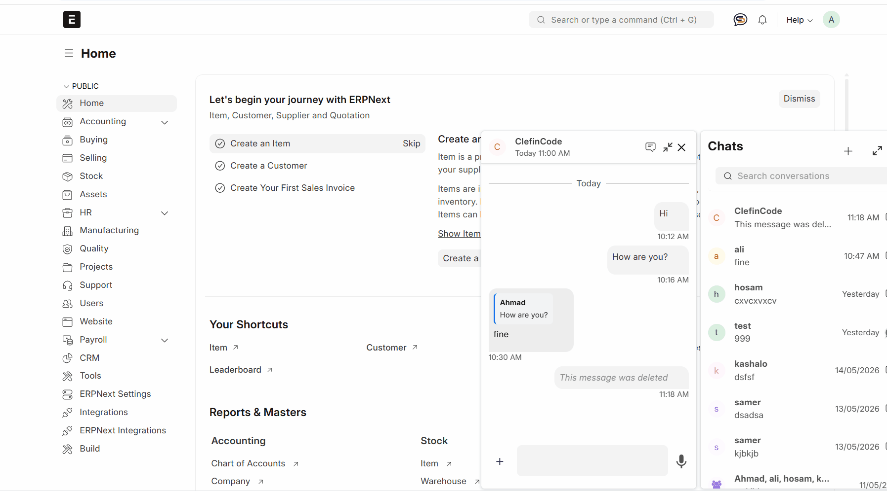

### 🧵 Topic Conversations

After messages are linked to a topic, the topic appears inside the main conversation as a colored topic bar.

- Each topic has its own color to make it easy to identify.
- Click the topic bar or arrow to open a separate conversation for that topic.
- Topic conversations show only messages linked to that topic.
- The topic chat header displays the topic name.
- From the topic header, users can add or remove linked DocTypes.
- Users can update the topic Status, Color, and Subject.

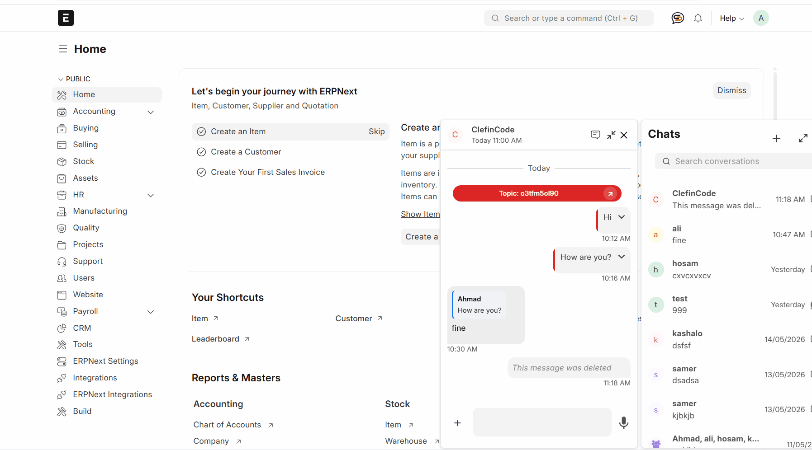
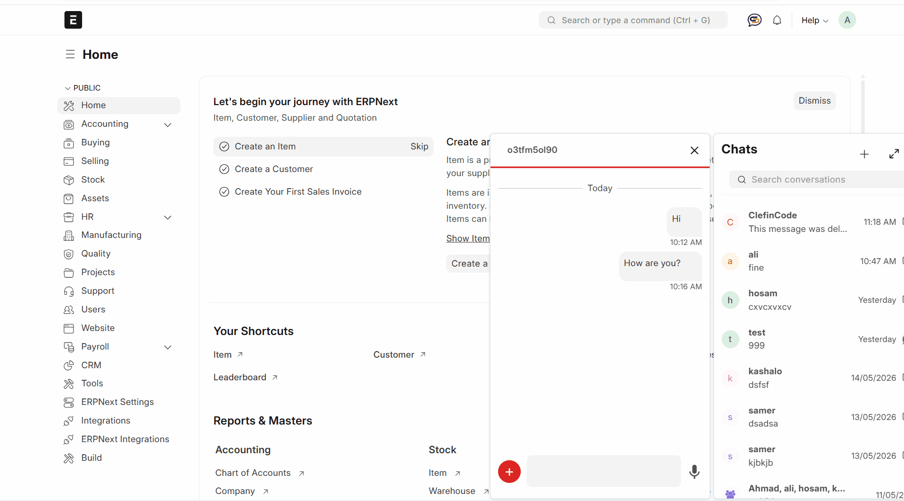

### ➕ Chat Plus Menu

The plus button beside the chat input gives quick access to attachments and topic actions.

Available actions:

- **Attach File** — upload and send a file in the conversation.
- **Select Topic** — choose an existing topic and open or link to it.
- **Add New Topic** — create a new topic from the chat.

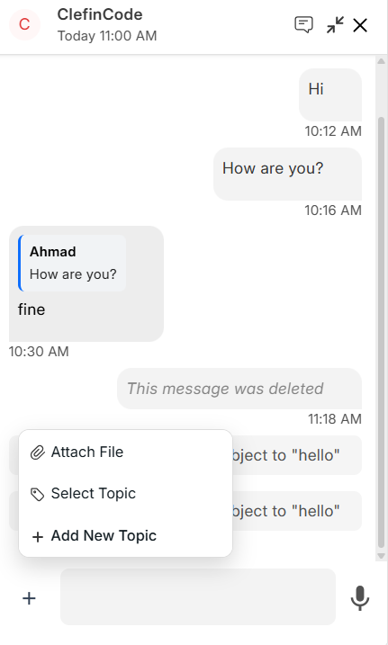

### 🏷 Select Topic

Select Topic lets users search and choose from existing topics directly inside the chat.

1. Click the `+` button beside the chat input.
2. Select **Select Topic**.
3. Use the search field to find a topic.
4. Click the arrow beside the topic to open or select it.

Each topic appears with its own colored indicator. A number may appear beside the topic name to show related message count or topic activity.

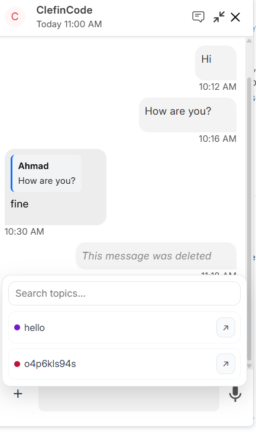

### ℹ️ Message Info

Message Info displays detailed information about a selected message.

1. Click the small arrow beside the message.
2. Select **Message Info**.
3. Review message details in the popup.

Information includes:

- Sender
- Linked Topic
- Sent At
- Message Type
- Message ID

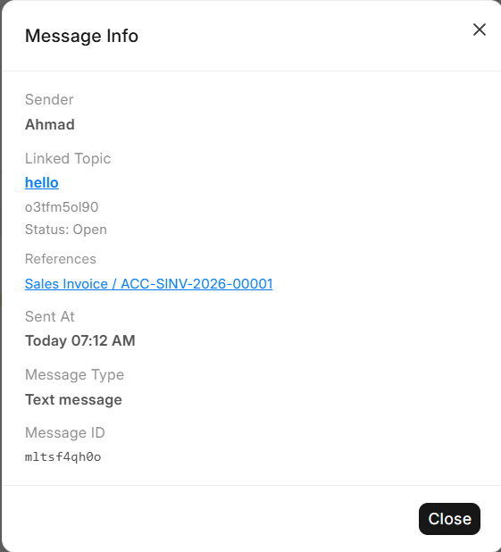

### 🔎 In-Chat Search

Find messages quickly inside the same conversation.

1. Open the desired chat.
2. Click the top area of the conversation.
3. Click the Search icon.
4. Enter your keyword and navigate results.

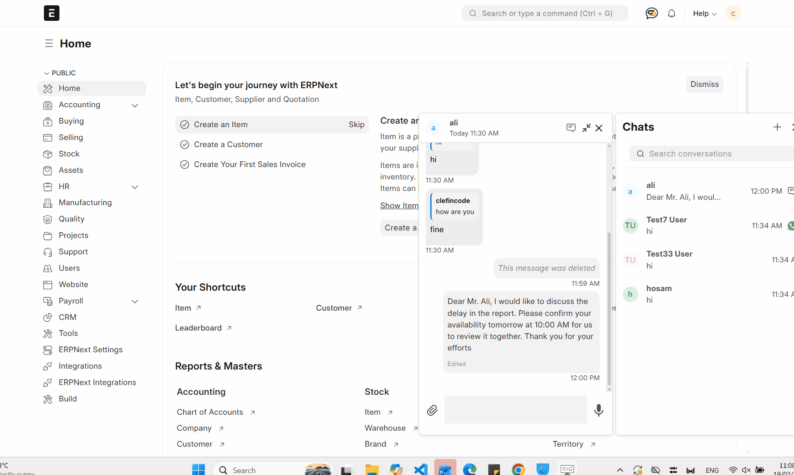

## Reporting Bugs

If you find any bugs, report them through [GitHub Issues](https://github.com/clefincode/clefincode_chat/issues).

## License

GNU General Public License (v3)
